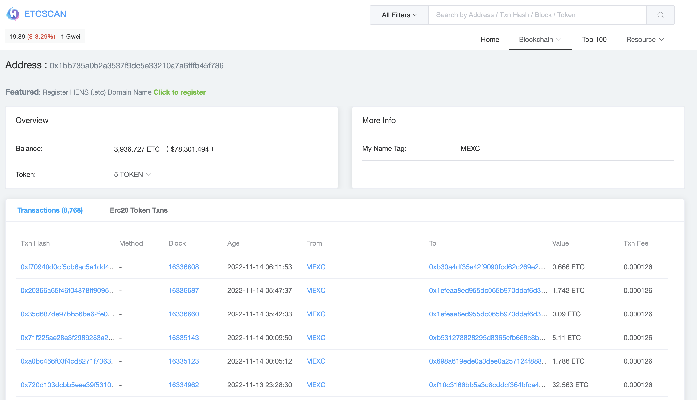
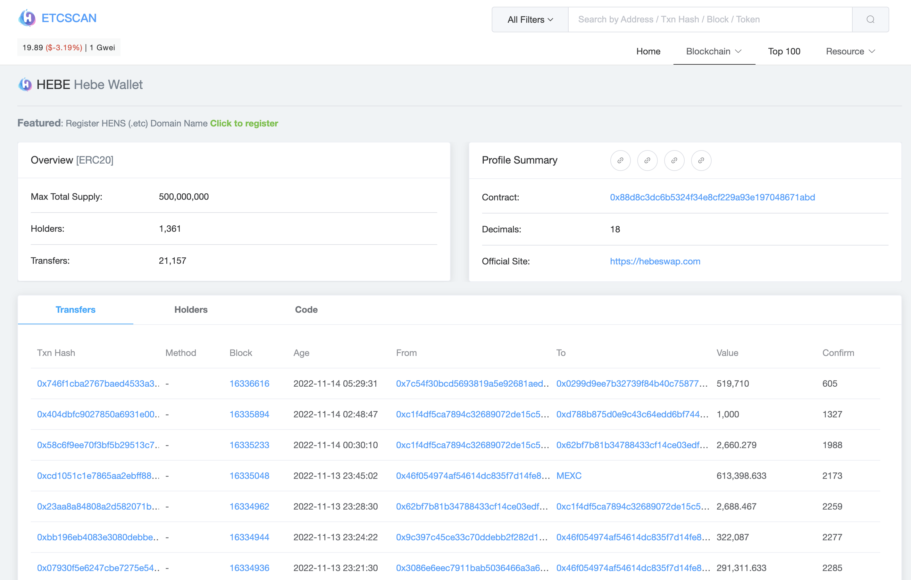

# ETCScanList

https://etcscan.etcdesktop.com

Used for address translation readable names in etcscan

For General addresses
---------------------
```js
"0x1bb735a0b2a3537f9dc5e33210a7a6fffb45f786": {
    "name": "MEXC"
}
```




For Contract addresses
---------------------
```js
 "0x88d8c3dc6b5324f34e8cf229a93e197048671abd": {
    "name": "Hebe Wallet",
    "links": {
      "web": "https://hebeswap.com",
      "twitter": "https://twitter.com/BlockHebe",
      "discord": "https://discord.gg/HFBUJ3AKFT",
      "telegram": "https://t.me/hebeOffice",
      "email": "hebeblock@gmail.com"
    }
  }
```

